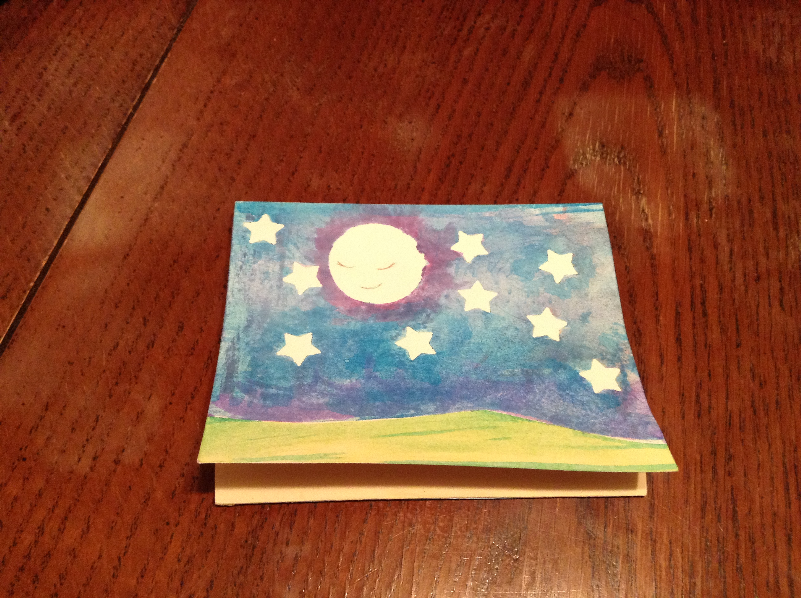
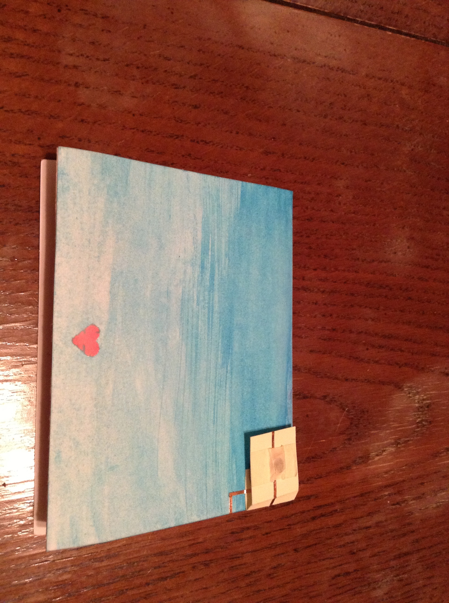
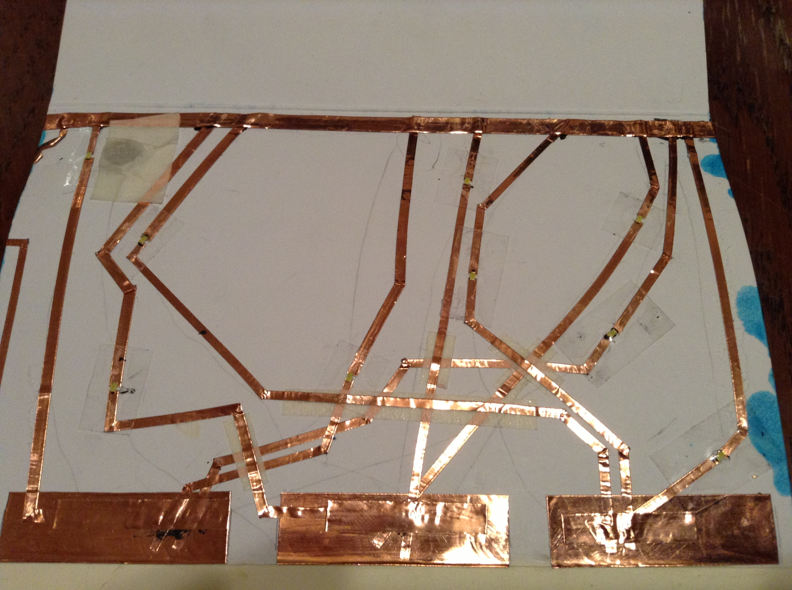
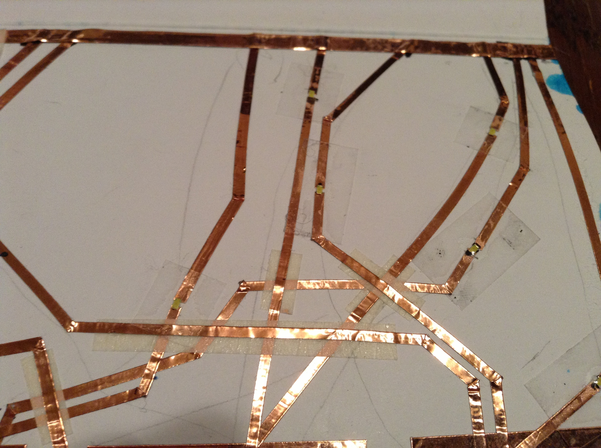
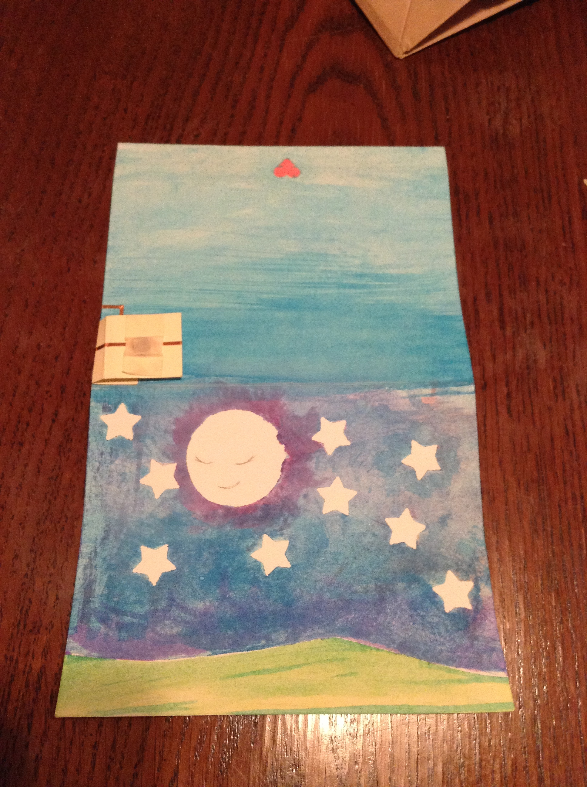

I made a card of the night sky.

Nine LEDs are connected to three different switch pads. As you slide your finger along the meadow on the bottom, the starts twinkle.

Here is a video of the twinkling effect in action. This particular card has taken a bit of a beating from being used as a demo for several groups, but you can get the gist of it.

<iframe src="//player.vimeo.com/video/90685737" width="500" height="281" frameborder="0" webkitallowfullscreen mozallowfullscreen allowfullscreen></iframe> 
<a href="http://vimeo.com/90685737">Twinkling Stars</a> from <a href="http://vimeo.com/user26524771">sndpt</a> on <a href="https://vimeo.com">Vimeo</a>.
